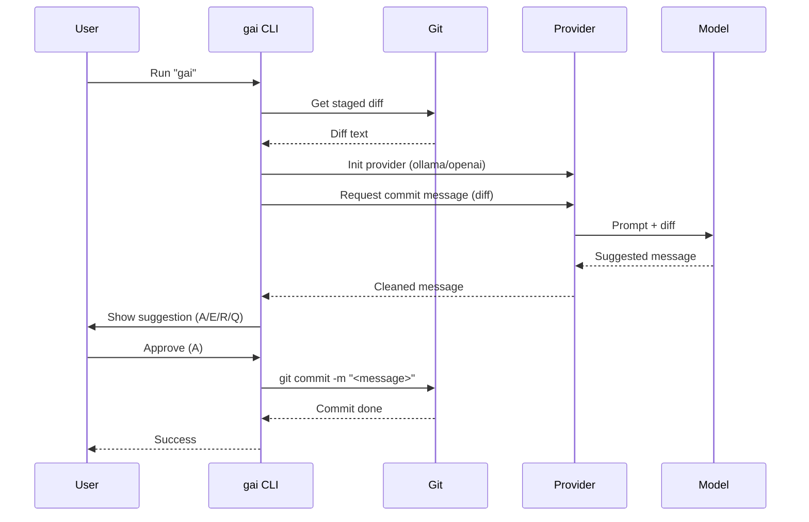

# gai-commit

AI-powered CLI tool to generate commit messages from your staged Git changes. Works with both local Ollama models and OpenAI's API.

## System Flow Digagram



## Installation

```bash
pip install gai-commit
```

## Usage Options

### 1. Using Ollama (Local LLMs)

Ollama provides free, locally-running AI models with no API keys required.

**Prerequisites:**
```bash
# 1. Install Ollama (https://ollama.com)
# 2. Pull a model (only needed once):
ollama pull llama3.2
# Ollama daemon should start automatically after installation
```

**Basic Usage:**
```bash
# Stage your changes first
git add path/to/modified/files

# Generate commit message with default model
gai

# Or specify a different Ollama model
gai deepseek-r1:8b
```

### 2. Using OpenAI (Cloud-based LLMs)

For higher quality results, you can use OpenAI's models (requires API key).

**Prerequisites:**
```bash
# Set your OpenAI API key (or add to .env file)
export OPENAI_API_KEY=sk-your-key
```

**Basic Usage:**
```bash
# Stage your changes first
git add path/to/modified/files

# Generate commit message with default model (gpt-3.5-turbo)
gai --provider openai

# Or specify a different OpenAI model
gai --provider openai gpt-4o
```

### Additional Options

```bash
# Generate a concise one-line commit message (subject only)
gai --oneline

# Combine with provider selection
gai --provider openai --oneline

# Configure maximum tokens per chunk for large diffs (default: 2000)
gai --max-tokens 1500

# 🆕 Use semantic analysis for better commit messages (Python only)
gai --semantic

# Semantic analysis reduces tokens by 80-95% and generates more accurate messages
gai --semantic --provider openai
```

### Semantic Diff Analysis (Experimental)

**NEW:** Use `--semantic` to analyze your code changes intelligently!

Instead of sending raw diffs to the AI, semantic analysis extracts **meaningful information**:
- Functions and classes added/modified/removed
- Import changes
- Code structure changes

**Benefits:**
- 🎯 **80-95% token reduction** - Massive cost savings
- 📊 **Better commit messages** - AI understands what changed, not just how
- ⚡ **Faster** - Less data to process

**Example:**
```bash
# Traditional approach: sends 5000 tokens
gai

# Semantic approach: sends only 200 tokens!
gai --semantic
```

**Currently supports:**
- ✅ Python files (.py) - Full AST analysis
- 🔄 Other files - Falls back to file-level analysis

**Future:** JavaScript, TypeScript, Go, and more languages coming soon!

## Interactive Workflow

After generating a commit message suggestion, you'll see:

```
Suggested Commit Message:
feat(parser): improve error resilience

- add fallback recovery for malformed input
- reduce panic cases in edge parsing paths
---
[A]pply, [E]dit, [R]-generate, or [Q]uit? (a/e/r/q)
```

Your options:
- **A**: Apply immediately (`git commit -m "<message>"`)
- **E**: Open your `$EDITOR` (defaults to `vim`) to refine the message
- **R**: Ask the AI to generate a new suggestion using the same diff
- **Q**: Quit without committing

## Security Best Practices

### API Key Management

**IMPORTANT:** Protect your API keys to prevent unauthorized usage and charges.

#### If You've Exposed an API Key

If you've accidentally committed an API key to version control or shared it:

1. **Immediately revoke the key**:
   - OpenAI: Visit https://platform.openai.com/api-keys
   - Find the exposed key and click "Revoke"
   - Generate a new key

2. **Remove from version control** (if committed to git):
   ```bash
   # Remove the file from git history
   git filter-branch --force --index-filter \
     "git rm --cached --ignore-unmatch .env" \
     --prune-empty --tag-name-filter cat -- --all

   # Or use git-filter-repo (recommended)
   git filter-repo --path .env --invert-paths
   ```

#### Recommended: Use Environment Variables

The most secure way to use API keys is through environment variables:

```bash
# Add to your shell profile (~/.bashrc, ~/.zshrc, etc.)
export OPENAI_API_KEY=sk-your-key-here

# Or use a .env file (already in .gitignore)
echo "OPENAI_API_KEY=sk-your-key-here" > .env
```

#### Config File Storage

This tool can save API keys to `~/.config/gai-commit/config.json` for convenience.

**WARNING:** Keys are stored in **plaintext** in this file. Anyone with access to your user account can read them.

- The config file is only readable by your user (permissions: 0600)
- For better security, use environment variables instead
- Never commit config files to version control

## Troubleshooting

### Common Issues

- **"No staged changes found"**: Use `git add` to stage your changes first
- **"Not a Git repository"**: Make sure you're inside a valid git repository
- **"OPENAI_API_KEY environment variable not set"**: Set your OpenAI API key or use Ollama
- **"Ollama connection refused"**: Make sure the Ollama daemon is running (`ollama serve`)

## Development

```bash
# Clone the repository
git clone https://github.com/muzahid59/gai
cd gai

# Install in development mode
pip install -e .

# Run tests
pytest tests -v
```

## Benchmarking

Compare different models' performance:

```bash
# Make sure to stage some changes first
python run_benchmark.py
```

## License

MIT - see [LICENSE](LICENSE)
